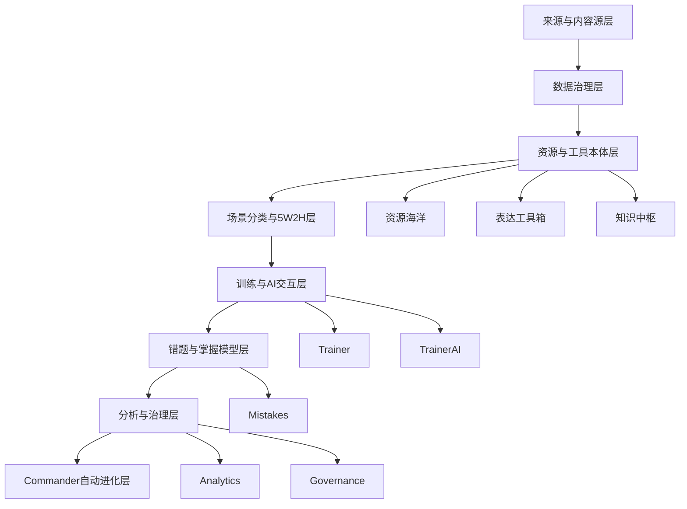

# 下一阶段统一产品架构与执行蓝图

更新日期：2026-05-23

## 1. 统一判断

当前项目已经具备资源海洋、浏览冲浪、训练中心、AI 伴侣、错题本、知识中枢、分析中心、治理台和 commander/DAG。下一阶段不能继续按“扩资源”“做工具箱”“优化页面”分散推进，而要统一成一个产品级闭环：

```text
高质量来源
  -> 可审计采集/生成批次
  -> 资源与表达工具本体
  -> 场景/目标/关系阶段分类
  -> 训练题与 AI 伴侣调用
  -> 错题改写与掌握模型
  -> 分析中心与治理后台
  -> commander 自动进化
```

其中“表达工具箱”不是新增孤岛，而是贯穿资源、训练、AI、错题、知识和复盘的表达能力层。

## 2. 北极星目标

把系统从“资源多的关系训练网站”升级为：

```text
世界级微关系表达与感知训练场
```

用户最终能完成四件事：

1. 看懂：识别微关系信号、情绪流、需求、边界和关系阶段。
2. 选对：知道此刻该用什么表达工具，而不是背话术。
3. 说好：能组织自然、有边界、有情绪流动的回应。
4. 复盘：能从错题和长期趋势中形成自己的表达能力画像。

## 3. 总体分层架构



## 4. 能力域重构

### 4.1 内容质量治理域

目标：让资源不是数量堆砌，而是高质量、低重复、可训练、可审计。

| 子域 | 功能 | 最小执行单元 | 验收 |
|---|---|---|---|
| 语义近重复 | 用向量相似度识别近重复 | 新增 `resource_similarity_queue` 或复用 vector index 输出近重复簇 | 首屏 48 条连续同场景/同标题不超过 3 条 |
| 内容分层 | 不同资源类型有不同字段与展示 | story/phrase/game/media/flirty 拆分展示模板 | 每类卡片显示专属结构 |
| 场景扩容 | 16 核心场景扩到 100+ | `scenario_bank` 入库或生成器场景库扩充 | 每条主线至少 12 个具体场景 |
| 四维评分 | 具体性、可练性、情绪流、边界清晰 | quality report 增加四维评分 | `/api/resources/quality-report` 返回四维指标 |
| 低质隔离 | 不删除，默认不展示 | `quarantine` / `review_status` / quality threshold | 默认列表不显示低质项 |

### 4.2 表达工具箱域

目标：把表达方法从文档变成训练系统的可调用能力。

| 子域 | 功能 | 最小执行单元 | 验收 |
|---|---|---|---|
| 工具本体 | 60 个基础表达工具 | `expression_tools` 表 + seed | API 可查询 60 工具 |
| 工具组合 | 场景 × 目标推荐工具链 | `expression_tool_chains` 表 | 输入场景返回 2-3 工具链 |
| 工具页面 | `/expression` 浏览与学习 | 工具列表、详情、场景矩阵 | 页面可按层/场景/目标筛选 |
| 训练评分 | Trainer 返回工具适配评分 | `tool_fit_score`、`structure_score` | compare 结果显示工具建议 |
| 错题归因 | 错题指出错用/缺失工具 | Mistake detail 增加表达工具归因 | 错题页显示推荐工具和三版本改写 |
| AI 解释 | AI 伴侣说明工具链 | Partner response 增加 `tool_chain` | 回复包含“为什么这样说” |

### 4.3 资源海洋页面域

目标：从“列表翻页”升级为可探索、可定位、可训练入口。

| 子域 | 功能 | 最小执行单元 | 验收 |
|---|---|---|---|
| 高级检索 | 关键词/类型/场景/标签/来源/质量/难度/表达工具 | API + URL query | 刷新后保留筛选 |
| 主线分组 | 微关系信号/情绪流动/边界同意/暧昧张力/冲突修复等 | segmented control 或 tabs | 一键切换主线 |
| 详情页 | `/resources/:id` | 独立详情、来源、练习入口 | 可打开完整记录 |
| 加入练习 | 资源转训练/错题/AI | “加入练习”动作 | 生成训练上下文 |
| 目录升级 | 折叠目录 | 按类型/场景/标题目录 | 长列表浏览效率提升 |

### 4.4 浏览冲浪域

目标：从来源目录升级为透明、可审计、可转化的信息渠道地图。

| 子域 | 功能 | 最小执行单元 | 验收 |
|---|---|---|---|
| 链接健康 | 检查 http status/redirect/last_checked | `source_link_checks` 表 | 每来源有检查状态 |
| 中文来源扩展 | 中文社区/课程/播客/开源/心理科普 | 来源目录扩到 60+，中文 >= 40% | `/surf` 可筛中文来源 |
| 来源详情 | `/surf/:id` | 结构、适配模块、采集策略、风险说明 | 来源详情可打开 |
| 来源映射 | 查看该来源派生资源 | “查看相关资源”按钮 | 跳转 `/resources?source=` |
| 周期任务 | 定时链接检查 | commander/scheduler task | 生成链接健康报告 |

### 4.5 数据库与采集治理域

目标：让所有数据资产有主真源、批次、版本、来源、审计和回滚。

| 子域 | 功能 | 最小执行单元 | 验收 |
|---|---|---|---|
| 来源入库 | 代码常量迁入 SQLite | `content_sources` 或 `source_registry` 成为主真源 | API 从 DB 读来源 |
| 批次审计 | 每次生成/导入有 batch | `resource_batches` 表 | 每条资源可追溯 batch |
| 版本化 | 资源保留生成规则/prompt/schema 版本 | `resource_versions` 表 | 可查历史版本 |
| 向量近重复 | 相似度队列 | vector index KNN 输出治理候选 | 相似项进入队列 |
| 批次回滚 | dry-run/apply 回滚 | `batch_rollback` API | 可撤回某批资源 |

### 4.6 AI 伴侣与训练联动域

目标：AI 不再只是回复器，而是表达工具教练。

| 子域 | 功能 | 最小执行单元 | 验收 |
|---|---|---|---|
| 资源检索增强 | AI 回复引用具体案例 | Partner simulate 检索 1-3 条资源 | 回复返回关联资源 |
| 错题推荐 | 错题自动推荐资源/工具 | Mistake detail 返回推荐项 | 可一键进入练习 |
| 情绪动线 | 回复解释靠近/后退/边界变化 | response state explanation | 回复结构含状态变化 |
| 多角色陪练 | 温柔/挑战/冷静/暧昧等风格 | mode/style 参数 | 用户可切换陪练 |
| Provider 诊断 | 继续保留 DeepSeek 失败可见 | analytics/provider | 成功率/失败原因可查 |

### 4.7 运营后台与审计域

目标：把资源质量、来源健康、批次、重复、发布状态变成可运营对象。

| 子域 | 功能 | 最小执行单元 | 验收 |
|---|---|---|---|
| 资源治理台 | 低质/重复/失效/待发布 | `/governance` 新 tab | 可筛选与处理 |
| 发布闭环 | reviewed/published/withdrawn/quarantine | action API | 状态写入审计日志 |
| 质量仪表盘 | 数量/重复率/来源健康/质量分布 | `/analytics` 资源质量模块 | 可见趋势和告警 |
| 调度可视化 | 每日扩充/链接检查/去重状态 | scheduler health 扩展 | 最近执行可查 |
| 回滚审计 | 批次回滚报告 | governance report | dry-run 和 apply 可审计 |

## 5. 统一数据模型

### 5.1 新增核心表

```text
expression_tools
expression_tool_chains
resource_batches
resource_versions
resource_similarity_queue
source_link_checks
user_resource_actions
```

### 5.2 资源表增强字段

```text
mission_axis
expression_tool_ids_json
expression_goal
expression_level
speech_act
mistake_pattern
scenario_id
batch_id
version_id
quarantine_reason
```

### 5.3 训练尝试增强字段

```text
selected_tool_ids_json
tool_fit_score
structure_score
emotion_regulation_score
naturalness_score
related_resource_ids_json
expression_review_json
```

## 6. 统一 API 规划

| API | 说明 |
|---|---|
| `GET /api/expression/tools` | 表达工具列表 |
| `GET /api/expression/tools/{id}` | 工具详情 |
| `POST /api/expression/recommend` | 场景/目标推荐工具链 |
| `POST /api/expression/score` | 表达工具适配评分 |
| `GET /api/resources/{id}` | 资源详情页数据 |
| `POST /api/resources/{id}/actions` | 收藏/加入练习/发送 AI |
| `GET /api/resources/similarity` | 近重复治理队列 |
| `GET /api/sources/{id}` | 来源详情 |
| `POST /api/sources/link-check` | 链接健康检查 |
| `GET /api/governance/resources` | 资源治理队列 |
| `POST /api/governance/resources/action` | 发布/撤回/隔离/回滚 |

## 7. 统一前端页面

| 页面 | 关键功能 |
|---|---|
| `/resources` | 高级检索、主线分组、目录、资源卡、加入练习 |
| `/resources/:id` | 完整详情、来源、表达工具、训练入口 |
| `/surf` | 来源目录、中文/英文筛选、目录、链接状态 |
| `/surf/:id` | 来源详情、结构、风险、派生资源 |
| `/expression` | 表达工具箱总览 |
| `/expression/:id` | 工具详情、例句、练习、适用/禁用场景 |
| `/trainer` | 工具评分、推荐工具链 |
| `/trainer-ai` | 资源检索、工具链解释、多角色陪练 |
| `/mistakes` | 表达工具归因、三版本改写、推荐资源 |
| `/governance` | 资源治理、来源健康、批次回滚 |
| `/analytics` | 资源质量、来源健康、工具掌握趋势 |

## 8. 统一组件

| 组件 | 作用 |
|---|---|
| `PageTocSidebar` | 所有多记录页右侧目录 |
| `ResourceCard` | 资源列表卡 |
| `ResourceDetailPanel` | 资源详情结构 |
| `ExpressionToolCard` | 表达工具卡 |
| `ExpressionToolMatrix` | 场景 × 目标 × 工具矩阵 |
| `ToolChainExplainer` | 工具链解释 |
| `QualityBadgeStack` | 质量/来源/状态徽标 |
| `GovernanceActionPanel` | dry-run/apply 操作面板 |
| `SourceHealthBadge` | 来源链接健康状态 |

## 9. DAG 任务清单

### P0 立即执行

| 顺序 | DAG ID | 任务 | 验收 |
|---:|---|---|---|
| 1 | `toc_sidebar_unification` | 抽象统一目录组件并接入 resources/surf | 页面有目录、顶部/底部、无溢出 |
| 2 | `resource_mission_group_view` | 资源海洋主线分组视图 | 可按八大主线切换 |
| 3 | `resource_semantic_dedupe_queue` | 语义近重复队列 | 近重复簇可查询 |
| 4 | `expression_schema` | 表达工具 schema | migration + tests |
| 5 | `expression_seed_tools` | 60 基础工具入库 | API 返回工具 |
| 6 | `expression_page` | `/expression` 页面 | type-check/build/browser |
| 7 | `resource_detail_page` | `/resources/:id` | 完整记录可打开 |

### P1 训练闭环

| 顺序 | DAG ID | 任务 | 验收 |
|---:|---|---|---|
| 8 | `resource_expression_tagging` | 资源挂载表达工具 | 可按工具筛选 |
| 9 | `trainer_expression_scoring` | Trainer 工具评分 | compare 返回工具建议 |
| 10 | `mistake_expression_rewrite` | 错题表达归因 | 错题页三版本改写 |
| 11 | `ai_partner_resource_retrieval` | AI 伴侣检索资源 | 回复关联 1-3 条资源 |
| 12 | `ai_partner_expression_chain` | AI 解释工具链 | 回复说明工具选择 |

### P2 运营治理

| 顺序 | DAG ID | 任务 | 验收 |
|---:|---|---|---|
| 13 | `content_sources_db_primary` | 来源目录 DB 主真源 | `/surf` 从 DB 读 |
| 14 | `source_link_health_audit` | 链接健康检查 | 每来源有 last_checked |
| 15 | `resource_batch_audit` | 资源批次审计 | 每条资源可追溯 batch |
| 16 | `resource_governance_console` | 资源治理台 | 低质/重复/失效可处理 |
| 17 | `resource_quality_analytics` | 质量仪表盘 | 质量趋势可视化 |
| 18 | `batch_rollback_dry_run` | 批次回滚 | dry-run/apply 可审计 |

## 10. 验收门禁

每一轮必须满足：

```text
后端相关 pytest 通过
ruff touched files 通过
前端 type-check 通过
前端 build 通过
涉及页面必须浏览器验证
docs/progress.md 更新
docs/validation_report.md 更新
commander sync-state
```

## 11. 下一轮最小高价值闭环

下一轮建议执行：

```text
toc_sidebar_unification
```

原因：

1. 用户已多次明确提出多记录页目录问题。
2. 它能同时改善资源海洋、浏览冲浪、知识中枢、治理台、分析中心。
3. 它是低风险、高可见价值的前端基础设施。
4. 后续 `/expression`、资源详情页、来源详情页都可复用。

完成后立即接：

```text
expression_schema -> expression_seed_tools -> expression_page
```

这样就能把表达工具箱从方案推进到真实可用产品。
