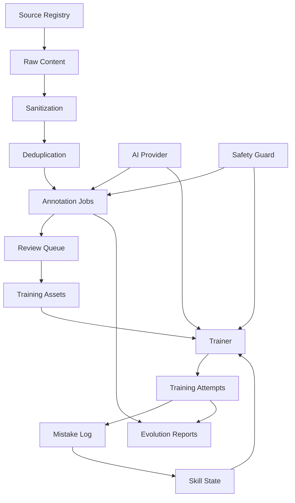

# 指挥官-执行者构建蓝图

更新日期：2026-05-20

本文档定义本项目后续的实用构建模式：一个指挥官负责目标、依赖、质量门禁与集成，多个执行者负责边界清晰的模块实施。该模式用于把“世界级关系动力学系统”的宏大目标拆成可验证、可并行、可回滚的工程任务。

## 1. 核心原则

1. 指挥官不直接追求一次性大爆发，而是维护系统连续进化。
2. 执行者只拥有明确模块，不跨边界重构。
3. 每个任务必须有输入、输出、验收命令、风险说明。
4. 所有 AI 生成内容必须可追踪：来源、模型、prompt、版本、审核状态。
5. 安全和隐私是硬门禁，不是上线前补丁。
6. 世界级体验来自闭环：训练、反馈、复习、进化、评测、再训练。

## 2. 角色定义

### 2.1 指挥官

职责：

- 维护产品北极星和阶段目标。
- 读取 `docs/tasks.md`、审计报告和测试结果。
- 分配互不冲突的执行者任务。
- 合并执行者结果。
- 运行全局验证命令。
- 更新文档、风险、路线图。
- 遇到冲突时保护已有用户改动。

指挥官不做：

- 不让多个执行者改同一核心文件，除非明确顺序。
- 不接受未验证的“大量生成代码”。
- 不把无法追踪的社交平台原文直接放进训练库。

### 2.2 执行者

执行者按模块分工：

| 执行者 | 负责范围 | 典型文件 |
|---|---|---|
| AI 执行者 | Provider、Prompt、JSON schema、安全拒绝 | `backend/ai/`, `backend/api/training.py` |
| 数据执行者 | 来源、导入、去重、脱敏、标注、进化流水线 | `backend/database/`, `backend/models/evolution.py`, `backend/api/evolution.py` |
| 训练执行者 | 训练流程、评分、错题、掌握模型 | `backend/api/training.py`, `backend/core/`, `frontend/src/pages/Trainer.vue` |
| 前端执行者 | 交互、响应式、状态管理、可视化 | `frontend/src/` |
| 质量执行者 | ruff、mypy、pytest、vue-tsc、Playwright | `pyproject.toml`, `tests/`, `frontend/package*.json` |
| 安全执行者 | 反操控、危机升级、隐私合规、审计日志 | `backend/ai/safety.py`, safety models/tests |

## 3. 任务协议

每个任务必须写成：

```text
目标：
负责范围：
禁止修改：
输入资料：
输出产物：
验收命令：
失败处理：
```

示例：

```text
目标：修复 DeepSeek Provider 适配
负责范围：backend/ai/*, tests/test_ai_*.py
禁止修改：frontend/*, data/*
输入资料：DeepSeek 官方 API 文档、现有 provider_client.py
输出产物：可配置 native/openai-compatible provider，mock 测试
验收命令：.venv/bin/python -m pytest tests/test_ai_provider.py -q
失败处理：保留规则评分 fallback，记录错误 reason
```

## 4. 模块依赖图



## 5. 质量门禁

### 5.1 短期门禁

```bash
.venv/bin/python -m pytest -q
cd frontend && npm run build
```

### 5.2 专业门禁

```bash
.venv/bin/python -m ruff check backend tests
.venv/bin/python -m mypy backend/api backend/core backend/ai --strict
.venv/bin/python -m pytest --cov=backend --cov-report=term-missing
cd frontend && npm run type-check && npm run build
```

### 5.3 世界级门禁

```text
AI JSON 成功率 >= 95%
安全拒绝测试通过率 = 100%
Gold sample 评分相关性 >= 0.75
训练推荐可解释率 >= 95%
样本来源可追踪率 = 100%
高风险隐私样本入库数 = 0
核心前端路径 E2E 通过率 = 100%
```

## 6. 进化流水线状态

进化中心不能只展示文章列表，必须展示生命体指标：

```text
source_count
raw_items_count
sanitized_items_count
dedupe_rate
annotation_confidence_avg
review_pass_rate
published_samples_count
rejected_items_count
safety_rejection_count
weekly_learning_delta
```

在完整 schema 建成前，可以先用现有 `evolution_sources`、`evolution_items`、`evolution_reports` 聚合出最小可用版本。

## 7. 安全策略

所有执行者都要遵守：

- 不生成操控、欺骗、煤气灯、跟踪、逼迫、威胁、规避拒绝的话术。
- 不把 AI 伴侣设计成现实关系替代品。
- 不存储可识别真实用户对话，除非用户明确本地授权。
- 不把公开平台内容直接当作可训练数据；只可抽象模式、摘要、链接和合规元数据。
- 危机、暴力、自伤、性侵、未成年人风险触发安全升级。

## 8. 指挥官每轮收尾清单

每轮结束前检查：

- 哪些文件被改了？
- 是否保护了用户原有改动？
- 是否运行了相关测试？
- 是否更新了文档和任务状态？
- 是否有未解决风险？
- 下一轮最小可执行任务是什么？

该清单让项目保持连续推进，而不是在宏大想象和零散补丁之间摇摆。
