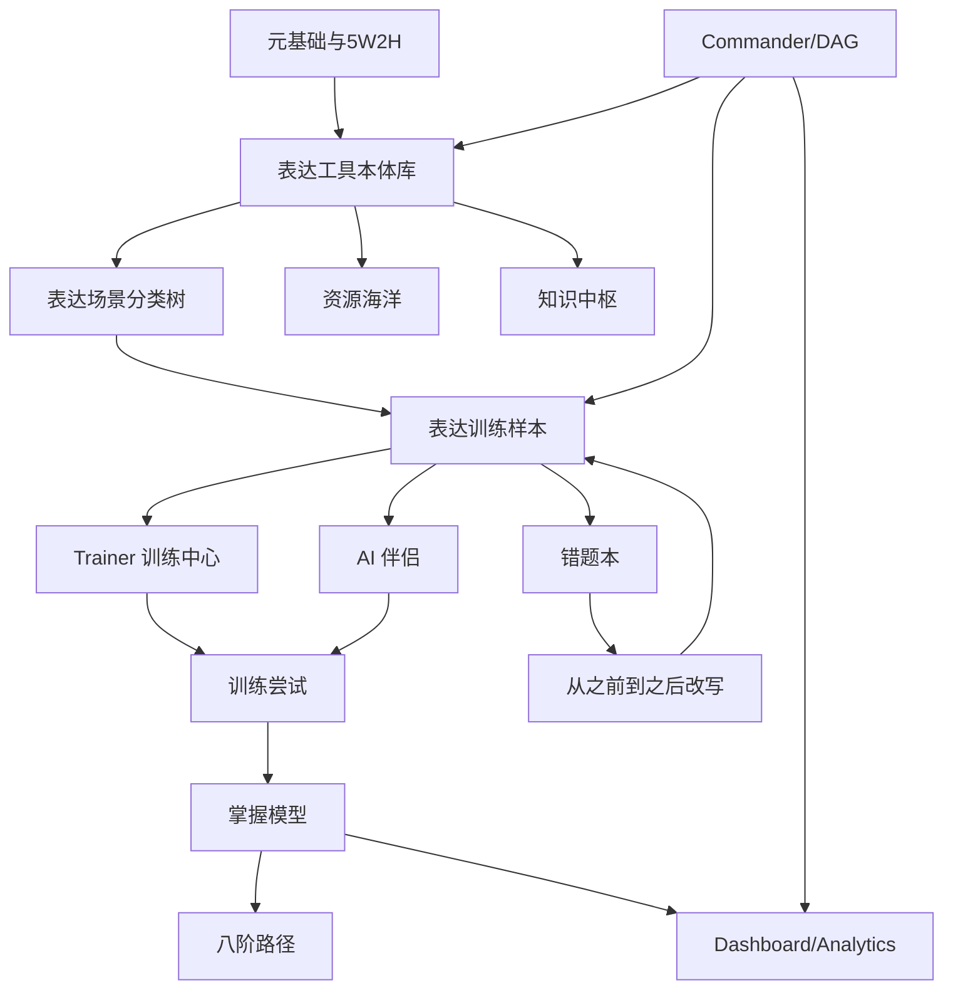

# 表达工具箱贯通架构方案

更新日期：2026-05-23

## 1. 定位

表达工具箱不是一个独立知识页，而是“微关系动力学全息”的表达能力层。它把用户从“看懂关系信号”继续推进到“选择合适表达工具、组织回应结构、调节非语言与情绪、复盘表达效果”的完整闭环。

项目原有主线是：

```text
元事实 -> 原子信号 -> 情绪流 -> 需求边界 -> 互动回路 -> 关系阶段 -> 高维复盘
```

表达工具箱嵌入后的主线升级为：

```text
看见信号
  -> 识别场景与关系任务
  -> 选择表达工具
  -> 组织表达结构
  -> 调节情绪与非语言
  -> 输出回应
  -> 观察反馈
  -> 错题改写
  -> 熟能生巧
```

## 2. 世界级总架构



## 3. 表达工具箱六层模型

| 层级 | 名称 | 目标 | 项目承载 |
|---|---|---|---|
| L1 | 核心逻辑层 | 决定说什么 | 知识中枢、训练提示、AI 评分维度 |
| L2 | 内容弹药层 | 决定用什么话说 | 资源海洋、话术库、故事库 |
| L3 | 结构设计层 | 决定按什么顺序说 | Trainer 评分、错题改写 |
| L4 | 非语言工具层 | 决定如何让表达有力 | 场景卡、视觉提示、复盘清单 |
| L5 | 情绪调节层 | 决定对方以什么状态接收 | 情绪流、AI 伴侣、错题本 |
| L6 | 关系管理层 | 决定沟通后关系走向 | 长期画像、八阶路径、Dashboard |

## 4. 与现有 12 类分类树的映射

| 项目分类 | 表达工具箱映射 | 需要新增字段 |
|---|---|---|
| 场景分类 | 工具适用场景 | `expression_scene` |
| 关系阶段分类 | 工具阶段适配 | `stage_fit` |
| 信息与信号分类 | 触发表达工具选择 | `trigger_signals_json` |
| 情绪与感受分类 | 情绪调节工具选择 | `emotion_regulation_tools_json` |
| 需求与边界分类 | 边界表达与同意确认 | `boundary_expression_json` |
| 依恋与人格倾向分类 | 表达风格适配 | `attachment_expression_fit_json` |
| 互动动作分类 | 表达动作类型 | `speech_act` |
| 回应策略分类 | 工具链组合 | `expression_tool_chain_json` |
| 风险与安全分类 | 禁用/降级表达 | `expression_safety_flags_json` |
| 学习任务分类 | 表达训练任务 | `expression_drills_json` |
| 数据来源与质量分类 | 工具来源与许可 | `tool_source_metadata_json` |
| 高维复盘分类 | 表达效果复盘 | `expression_review_json` |

## 5. 表达工具本体库

### 5.1 Tool Ontology

每个表达工具必须结构化为：

```json
{
  "tool_id": "expr_prep_001",
  "name": "PREP模型",
  "layer": "structure",
  "formula": "观点 -> 理由 -> 例子 -> 重申观点",
  "best_scenes": ["即兴发言", "观点表达", "冲突解释"],
  "relationship_fit": ["初识", "平淡", "修复", "分歧"],
  "emotion_fit": ["紧张", "犹豫", "需要清晰"],
  "risk_flags": ["过度说教", "忽视情绪"],
  "micro_steps": ["先给结论", "补一个理由", "给具体例子", "收束成下一步"],
  "example_before": "我也不知道怎么说，反正你这样我不舒服。",
  "example_after": "我希望我们先把时间说清楚。因为临时变化会让我很难安排。比如这周两次都改到最后一刻。所以下次如果要改，我们提前一天确认。",
  "mastery_stage": "operation"
}
```

### 5.2 工具类型

| 类型 | 工具示例 | 核心用途 |
|---|---|---|
| 逻辑框架 | 金字塔、SCQA、PREP、ORID | 清晰表达与复盘 |
| 情绪框架 | 情绪标注、共情反射、暂停协议 | 降低防御与冲突升级 |
| 关系框架 | 三明治反馈、自我揭露、未来挂钩 | 保留连接与长期关系 |
| 叙事框架 | 场景化、故事叙述、悬念倒置 | 让表达有画面和情绪流 |
| 说服框架 | 递进说服、利弊对比、黄金圈 | 从共识到行动 |
| 非语言框架 | 停顿、眼神、姿态、距离、声音 | 增强真实感与边界感 |

## 6. 表达场景矩阵

### 6.1 横轴：关系场景

```text
初识破冰
日常闲聊
暧昧试探
约会邀约
赞美承接
边界确认
失望表达
冲突降温
道歉修复
冷战复联
长期协商
分离告别
公开场合止损
亲密推进
价值观分歧
压力支持
```

### 6.2 纵轴：表达目标

```text
说清事实
命名感受
表达需求
确认边界
制造轻张力
降低防御
提出请求
给出反馈
拒绝但留连接
修复信任
引导深聊
保留退路
```

### 6.3 深度等级

| 等级 | 名称 | 用户能力目标 |
|---|---|---|
| D1 | 识别 | 知道该场景适合什么工具 |
| D2 | 套用 | 能按模板说出一句可用表达 |
| D3 | 改写 | 能把错误回应改成更好回应 |
| D4 | 迁移 | 能换场景使用同一工具 |
| D5 | 自然 | 能不显套路地即时表达 |

## 7. 训练闭环设计

### 7.1 Trainer 训练题结构

训练题新增表达维度：

```json
{
  "context": "你答应周末吃饭，却临时改安排，对方只回“嗯”。",
  "their_words": "嗯，知道了。",
  "detected_signals": ["短回复", "压住失望", "低能量"],
  "relationship_task": "失望修复",
  "recommended_tools": ["情绪标注", "事实影响承认", "具体补偿", "暂停解释"],
  "forbidden_tools": ["反问逼迫", "自我辩解", "冷处理"],
  "answer_requirements": {
    "must_include": ["承认影响", "少解释", "具体行动"],
    "must_avoid": ["要求立刻原谅", "责怪对方情绪"]
  }
}
```

### 7.2 评分维度

| 维度 | 权重 | 说明 |
|---|---:|---|
| 事实准确 | 15 | 不脑补、不歪曲 |
| 情绪承接 | 20 | 能命名对方情绪 |
| 需求识别 | 15 | 看见底层需求 |
| 边界清晰 | 20 | 有退路、可拒绝 |
| 工具适配 | 15 | 工具选得对 |
| 表达自然 | 10 | 不像模板机器话 |
| 非操控安全 | 5 | 不施压、不诱导 |

### 7.3 错题归因

| 错因 | 对应训练 |
|---|---|
| 只讲道理 | 情绪标注 + 共情反射 |
| 过度讨好 | 边界确认 + 自我揭露 |
| 急于推进 | 暂停协议 + 可退出请求 |
| 回避表达 | PREP + FFC |
| 冲突升级 | ORID + 暂停协议 |
| 话术油腻 | 场景化 + 低压幽默 + 同意确认 |
| 结构混乱 | 金字塔 + SCQA |

## 8. 页面与产品功能划分

### 8.1 新增：表达工具箱页 `/expression`

模块：

1. 工具总览：按六层模型浏览工具。
2. 场景索引：按初识、暧昧、冲突、修复、长期连接进入。
3. 目标索引：按说服、安抚、拒绝、修复、深聊、调情进入。
4. 工具详情：公式、适用场景、禁用场景、例句、练习。
5. 组合推荐：一个场景自动推荐 2-3 个工具链。
6. 掌握进度：显示每个工具的 D1-D5 掌握阶段。

### 8.2 资源海洋升级

资源卡增加：

```text
表达工具：情绪标注 / PREP / FFC / 暂停协议
表达目标：修复信任
错误类型：急于解释
练习等级：D3 改写
关联训练：进入 Trainer
```

### 8.3 浏览冲浪升级

所有多记录页统一增加：

1. 右侧标题目录。
2. 顶部/底部跳转。
3. 来源按“学术、工具、社区、课程、开源、中文、英文”分组。
4. 每条来源挂载适配模块和可转化工具。

### 8.4 AI 伴侣升级

AI 回复不只给答案，而要输出：

```text
我读到的信号：
当前关系任务：
可用表达工具：
我给你的回应：
为什么这样说：
下一轮练习：
```

### 8.5 错题本升级

错题详情新增：

1. 旧回应用了什么错误工具。
2. 更适合用什么工具。
3. 三种改写版本：温柔版、清晰版、轻幽默版。
4. 迁移练习：换一个场景再说一次。

## 9. 数据库实现方案

### 9.1 新表：expression_tools

字段：

```text
id
tool_uuid
name
layer
category
formula
description
best_scenes_json
relationship_fit_json
emotion_fit_json
risk_flags_json
micro_steps_json
example_before
example_after
source
source_url
review_status
quality_score
created_at
updated_at
```

### 9.2 新表：expression_tool_chains

用于组合工具：

```text
id
chain_uuid
name
goal
scene
stage
tool_ids_json
sequence_json
forbidden_tools_json
example_dialogue_json
quality_score
review_status
```

### 9.3 资源表增强字段

```text
expression_tool_ids_json
expression_goal
expression_level
speech_act
mistake_pattern
recommended_drills_json
```

### 9.4 训练尝试增强字段

```text
selected_tool_ids_json
tool_fit_score
structure_score
emotion_regulation_score
naturalness_score
expression_review_json
```

## 10. API 方案

| API | 作用 |
|---|---|
| `GET /api/expression/tools` | 工具列表，支持 layer/category/scene/goal 筛选 |
| `GET /api/expression/tools/{id}` | 工具详情 |
| `GET /api/expression/chains` | 工具组合推荐 |
| `POST /api/expression/recommend` | 输入场景和目标，推荐工具链 |
| `POST /api/expression/score` | 对用户表达做工具适配评分 |
| `POST /api/expression/drills/generate` | 生成某工具的练习题 |
| `GET /api/expression/mastery` | 用户工具掌握图谱 |

## 11. 前端组件方案

| 组件 | 位置 | 功能 |
|---|---|---|
| `ExpressionToolCard` | `/expression` | 工具摘要卡 |
| `ExpressionToolDetail` | `/expression/:id` | 公式、步骤、例句 |
| `ToolChainBuilder` | Trainer/AI | 工具组合解释 |
| `ExpressionScorePanel` | Trainer | 表达评分 |
| `ExpressionMistakePanel` | Mistakes | 错误工具归因 |
| `ExpressionTocSidebar` | 多记录页 | 标题目录、锚点跳转 |
| `ScenarioToolMatrix` | Knowledge/Expression | 场景 × 目标 × 工具矩阵 |

## 12. 内容扩容方案

### 12.1 第一阶段：基础 60 工具

每层 10 个工具：

```text
逻辑层：金字塔、SCQA、PREP、ORID、FFC、STAR、MECE、黄金圈、利弊对比、问题树
弹药层：场景化、数据、引用、故事、类比、幽默、自嘲、设问、留白、对比
结构层：时间轴、空间轴、问题解决、递进说服、悬念倒置、复盘结构、请求结构、反馈结构、道歉结构、拒绝结构
非语言层：音量、语速、音调、停顿、眼神、手势、姿态、距离、道具、环境
情绪层：情绪标注、共情反射、换框、暂停协议、降温、积极重构、情绪对比、身体觉察、镜像、承接
关系层：三明治反馈、承诺一致、互惠开口、自我揭露、未来挂钩、边界声明、修复请求、感谢具体化、偏好校准、共同约定
```

### 12.2 第二阶段：场景 × 工具组合

目标：16 个主场景 × 12 个表达目标 × 3 个难度 = 576 条工具链。

### 12.3 第三阶段：训练样本

目标：每个工具链至少 10 个具体案例 = 5760 条表达训练样本。

## 13. DAG 任务拆分

| 顺序 | 任务 ID | 名称 | 验收 |
|---:|---|---|---|
| 1 | `expression_architecture_doc` | 表达工具箱架构文档 | 文档完成并写入 docs |
| 2 | `expression_schema` | 工具本体数据库 schema | migration + tests |
| 3 | `expression_seed_tools` | 60 个基础工具种子 | API 可查，质量分可审计 |
| 4 | `expression_api` | 工具推荐与评分 API | pytest 覆盖 |
| 5 | `expression_page` | `/expression` 工具箱页面 | type-check/build/browser |
| 6 | `resource_expression_tags` | 资源卡挂载表达工具 | 资源默认页可筛选 |
| 7 | `trainer_expression_scoring` | Trainer 表达评分 | compare 返回工具评分 |
| 8 | `mistake_expression_rewrite` | 错题表达工具归因 | 错题页显示推荐工具 |
| 9 | `ai_partner_expression_chain` | AI 伴侣工具链解释 | 回复含工具选择理由 |
| 10 | `toc_sidebar_unification` | 多记录页统一目录 | surf/resources/knowledge/governance/analytics |

## 14. 优先级实施顺序

### P0：先做可见价值

1. 多记录页面统一右侧目录组件。
2. 新建 `/expression` 表达工具箱页面。
3. 工具本体 seed 60 条。
4. 资源卡挂载表达工具和表达目标。
5. Trainer 评分结果显示“你该用哪个工具”。

### P1：做训练闭环

1. 错题本表达工具归因。
2. AI 伴侣输出工具链解释。
3. 工具掌握阶段 D1-D5。
4. 场景 × 目标 × 工具矩阵。

### P2：做长期进化

1. 工具使用趋势分析。
2. 用户个人十佳话术库。
3. 表达风格画像。
4. 语音/非语言训练占位。

## 15. 验收标准

1. 用户能在 30 秒内从场景找到合适表达工具。
2. 每个工具都有公式、适用场景、禁用场景、示例、练习。
3. Trainer 能指出“错在工具选择、结构、情绪承接还是边界”。
4. AI 伴侣回复不再只给话术，而能解释工具链。
5. 资源海洋可按表达工具检索。
6. 错题本能把旧回应改写为至少 3 种工具版本。
7. 所有多记录页有标题目录和顶部/底部跳转。

## 16. 当前差距

| 差距 | 影响 | 处理 |
|---|---|---|
| 表达工具还只是文档知识 | 无法进入训练评分 | 新建工具本体表 |
| 资源卡没有表达工具标签 | 搜索和学习路径不清晰 | 回填 expression tags |
| Trainer 评分没有工具维度 | 用户不知道该练什么 | 增加 tool_fit_score |
| AI 伴侣缺少工具链解释 | 回复仍可能显得空泛 | Prompt + fallback 结构升级 |
| 多记录页目录未统一 | 浏览成本高 | 抽象公共目录组件 |
| 非语言层还没有数据结构 | 只能文字训练 | 先做占位字段和知识卡 |

## 17. 指挥官下一步

下一轮最高价值任务：

```text
toc_sidebar_unification + expression_schema + expression_seed_tools
```

原因：先统一浏览体验，再把表达工具箱从文档变成数据库主真源，最后才能接入 Trainer、AI 伴侣、错题本和资源海洋。
